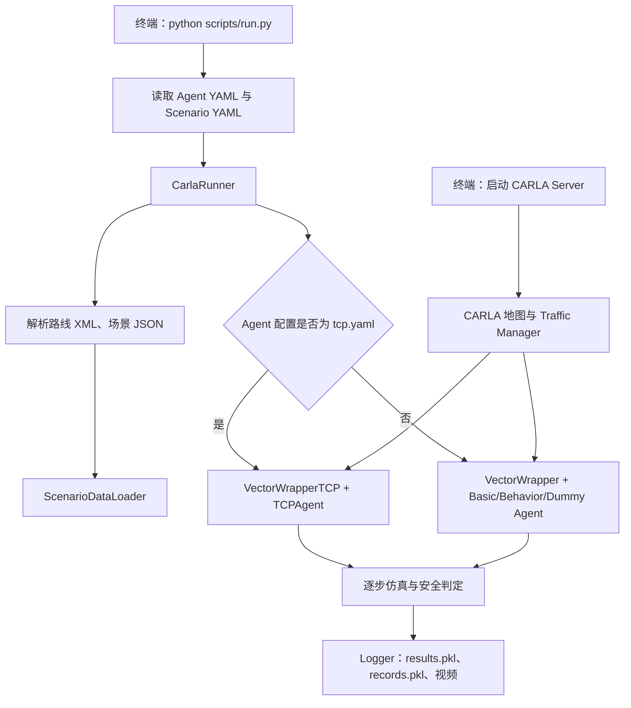

# SafeBenchHK：CARLA 自动驾驶安全测试平台

<p align="center">
  
</p>

> 面向第一次接触本项目的使用者：本文按当前仓库代码编写，带你从准备 CARLA、配置 Python 环境，到完成一次可复现的安全评测。请**从项目根目录**执行文中的命令。

SafeBenchHK 是一个基于 [CARLA](https://carla.org/) 的自动驾驶安全评测框架。它将预先定义的路线、交通参与者与风险场景加载到 CARLA 中，让被测自动驾驶 Agent 完成驾驶任务，并输出碰撞、路线完成度、偏离路线等安全指标和可选视频。本仓库已接入传统 CARLA Agent 与 TCP（Trajectory-guided Control Prediction）端到端驾驶模型。

## 先看这里：成功运行需要什么

一次运行由两个独立进程组成：CARLA 服务器负责仿真世界，本项目的 Python 程序负责加载场景、控制车辆和保存结果。两者缺一不可。

| 必需项 | 本仓库是否提供 | 你需要做什么 |
| --- | --- | --- |
| SafeBenchHK 代码、场景 JSON/XML、TCP 代码 | 是 | 在项目根目录运行 Python 命令 |
| Python/Conda 依赖 | 提供了 `TCP/environment.yml` | 创建并激活环境 |
| CARLA 服务端与 Python API | 否 | 向维护者确认与自定义地图匹配的 CARLA 构建，再安装同版本 Python API |
| `center` 等自定义 CARLA 地图 | 否 | 向项目维护者取得地图包并安装到 CARLA；普通 Town 地图不能直接替代 |
| TCP 预训练权重（仅 TCP 评测需要） | 否，已被 Git 忽略 | 放到本机并修改 `tcp.yaml` 的 `model_path` |

**最快的首次验证路径**：先安装环境和地图，然后使用不需要权重的 `basic.yaml` 执行一次评测；确认框架、地图和端口均正常后，再配置 TCP 权重运行 `tcp.yaml`。当前默认的场景清单很大，首次运行前请按“[首次评测](#首次评测从-basic-开始)”一节把 `route_id` 限制为 `0`。

## 目录

- [1. 项目能做什么](#1-项目能做什么)
- [2. 运行原理与目录导航](#2-运行原理与目录导航)
- [3. 环境准备](#3-环境准备)
- [4. 首次评测：从 Basic 开始](#4-首次评测从-basic-开始)
- [5. 运行 TCP 端到端模型](#5-运行-tcp-端到端模型)
- [6. 查看结果、视频与断点续跑](#6-查看结果视频与断点续跑)
- [7. 配置与命令行参数](#7-配置与命令行参数)
- [8. 场景、Agent 与训练能力说明](#8-场景agent-与训练能力说明)
- [9. 创建或导入新场景](#9-创建或导入新场景)
- [10. 常见错误排查](#10-常见错误排查)
- [11. 给开发者的扩展入口](#11-给开发者的扩展入口)

## 1. 项目能做什么

### 当前可直接使用的能力

| 能力 | 说明 | 入口/位置 |
| --- | --- | --- |
| 安全评测 | 在 CARLA 中执行路线与标准交通风险场景，保存指标和逐帧记录 | `scripts/run.py --mode eval` |
| 基准驾驶 Agent | `dummy`、`basic`、`behavior` | `safebench/agent/config/*.yaml` |
| TCP 端到端驾驶 | 前视摄像头 + 车辆状态输入，加载 TCP 权重推理 | `safebench/agent/config/tcp.yaml` |
| 标准风险场景 | 8 类交通场景，带路线和多天气条件 | `safebench/scenario/scenario_data/` |
| 结果与视频 | `results.pkl`、`records.pkl`，以及可选 MP4 | `log/<实验名>/` |
| 场景制作工具 | 提取地图路点、交互式选路线/触发点、导出与查重 | `tools/` |

### 当前不应期待的能力

虽然命令行保留了 `train_agent` 和 `train_scenario` 模式，当前注册的 `basic`、`behavior`、`dummy`、`tcp` Agent 都是不可在线学习的实现；标准场景策略也是固定策略。因此，开箱即用的主要用途是 **`eval` 安全评测**，不是从零训练强化学习模型。旧资料中出现的 SAC/PPO/TD3/DDPG、Normalizing Flow 等模块并未作为当前可运行 Agent 注册，请不要据此安排训练任务。

### 8 类标准场景

| ID | 场景类 | 交通风险概述 |
| --- | --- | --- |
| 1 | `DynamicObjectCrossing` | 行人横穿道路 |
| 2 | `VehicleTurningRoute` | 自车转弯时与直行车辆发生冲突 |
| 3 | `OtherLeadingVehicle` | 前车减速，可能伴随相邻车辆 |
| 4 | `LaneChange` | 前方低速/相邻车道车辆导致变道风险 |
| 5 | `OppositeVehicleRunningRedLight` | 对向车辆闯红灯 |
| 6 | `SignalizedJunctionLeftTurn` | 有信号灯路口左转冲突 |
| 7 | `SignalizedJunctionRightTurn` | 有信号灯路口右转冲突 |
| 8 | `NoSignalJunctionCrossingRoute` | 无信号路口穿越冲突 |

## 2. 运行原理与目录导航



### 关键目录

```text
SafeBenchHK/
├── README.md                         # 本指南
├── assets/                           # README 配图
├── scripts/run.py                    # 唯一的项目级训练/评测入口
├── safebench/
│   ├── carla_runner.py               # 连接 CARLA、调度评测/训练
│   ├── agent/                        # 被测 Agent 与 YAML 配置
│   │   ├── config/basic.yaml
│   │   ├── config/behavior.yaml
│   │   ├── config/dummy.yaml
│   │   └── config/tcp.yaml
│   ├── scenario/                     # 场景定义、场景数据和场景策略
│   │   ├── config/standard.yaml      # 默认场景配置
│   │   └── scenario_data/            # central、ShaTin 等路线和场景文件
│   ├── gym_carla/                    # CARLA 环境封装；TCP 有专用封装
│   └── util/                         # 日志、指标和通用工具
├── TCP/                              # TCP 原始模型及其 Leaderboard/ScenarioRunner 依赖
├── tools/                            # 地图与场景制作、导出和可视化工具
└── log/                              # 运行结果默认写入位置（运行后生成内容）
```

运行时的数据流是：`scripts/run.py` 读取两个 YAML → `CarlaRunner` 连接 `localhost:<port>` → 读取场景 JSON 和路线 XML → 加载 CARLA 地图 → Agent 输出 `[throttle, steer]` 控制 → 场景和评价器逐帧更新 → `Logger` 保存结果。

## 3. 环境准备

### 3.1 操作系统与硬件建议

仓库中的 TCP 环境文件面向 Linux、Python 3.7 和 CUDA 11.3 编写。推荐使用一台 Linux 主机（如 Ubuntu）、Conda、足够的磁盘空间，以及 NVIDIA GPU。`basic`/`behavior` 可以在 CPU 上运行，但 CARLA 仿真和 TCP 推理通常需要较多图形与计算资源。

请保证：

- 已安装 `conda`（Miniconda 或 Anaconda）。
- 有两个空闲端口：默认 CARLA RPC 为 `2000`，Traffic Manager 为 `8000`。
- 运行图形/视频时有可用的 OpenGL、显卡驱动和磁盘空间。
- 所有后续命令均在项目根目录 `SafeBenchHK/` 下执行，除非命令特别说明。

### 3.2 建立 Python 环境

`setup.py` 只声明了 `gym` 和 `pygame`，不足以安装完整依赖。对于当前含 TCP 的仓库，优先使用保留在 `TCP/environment.yml` 中的已验证环境组合，不要将多个旧 `requirements` 文件不加区分地同时安装（其中存在重复且版本不一致的固定依赖）。

```bash
# 在项目根目录执行；-n 会把环境名称改为 safebenchhk
conda env create -f TCP/environment.yml -n safebenchhk
conda activate safebenchhk

# 安装本仓库的 safebench 包；仍建议从项目根目录运行脚本
python -m pip install -e .
```

检查基础环境：

```bash
python --version
python -c "import torch; print('torch:', torch.__version__, 'cuda:', torch.cuda.is_available())"
python -c "import safebench; print('safebench import OK')"
```

如果 Conda 在创建环境时因镜像或旧包不可用而失败，请按照 `TCP/environment.yml` 的核心版本手工重建：Python 3.7、PyTorch 1.10.1、Torchvision 0.11.2、CUDA Toolkit 11.3，再补齐其中列出的 pip 依赖。不要在同一环境里混装不兼容的新版 PyTorch/Torchvision。

### 3.3 安装与地图包匹配的 CARLA 和 Python API

当前仓库**不能仅凭代码唯一确定 CARLA 版本**：`TCP/README.md` 保留的上游 TCP 说明使用 CARLA 0.9.10.1，而 `TCP/scenario_runner/CARLA_VER` 仍记录 0.9.9；仓库又未包含 `center` 自定义地图的 CARLA 资产。因此，应以项目维护者提供的“CARLA 服务端 + 自定义地图包”组合为准，并把该服务端对应的 Python API 安装到当前 Conda 环境。不要混用不同版本的服务端、地图包和 `.egg`。

下面命令只适用于维护者明确指定 **CARLA 0.9.10.1** 的情况；它来自仓库保留的上游 TCP 安装说明。官方 `AdditionalMaps` 不包含本项目的 `center` 自定义地图，不能替代维护者提供的地图包。

```bash
# 先记住项目根目录，避免假定你的克隆目录必须名为 SafeBenchHK
PROJECT_ROOT="$(pwd)"
mkdir -p "$PROJECT_ROOT/../carla"
cd "$PROJECT_ROOT/../carla"
wget https://carla-releases.s3.eu-west-3.amazonaws.com/Linux/CARLA_0.9.10.1.tar.gz
wget https://carla-releases.s3.eu-west-3.amazonaws.com/Linux/AdditionalMaps_0.9.10.1.tar.gz
tar -xf CARLA_0.9.10.1.tar.gz
tar -xf AdditionalMaps_0.9.10.1.tar.gz
cd "$PROJECT_ROOT"

# 每次新开终端后均可设置；请改为你的 CARLA 实际绝对路径
export CARLA_ROOT="$(cd "$PROJECT_ROOT/../carla" && pwd)"
```

然后将**该 CARLA 构建随附**的 Python API 安装到刚才激活的 Conda 环境。若维护者确认使用 CARLA 0.9.10.1 和 Python 3.7，包通常名为 `carla-0.9.10-py3.7-linux-x86_64.egg`；无论文件名是什么，都应先列出真实文件，再选择与当前 Python、操作系统和 CPU 架构相符的那一个。

```bash
ls "$CARLA_ROOT/PythonAPI/carla/dist/"
python -m pip install "$CARLA_ROOT/PythonAPI/carla/dist/carla-0.9.10-py3.7-linux-x86_64.egg"

python -c "import carla; print('CARLA Python API:', carla.__file__)"
```

若你的 CARLA 压缩包没有该 `.egg`，请使用其 `PythonAPI/carla/dist/` 中与当前 Python 主次版本、操作系统和 CPU 架构完全一致的文件。`No module named 'carla'` 几乎总是因为这一步漏做，或 `.egg` 版本不匹配。

### 3.4 安装项目自定义地图：这是不可跳过的前置条件

默认 [`standard.yaml`](safebench/scenario/config/standard.yaml) 使用 `new_central_2` 场景数据，其中路线 XML 的地图名是 **`center`**。`central`、`ShaTin` 等同样对应项目的自定义地图数据；它们不是 CARLA 发布包中的标准 `TownXX` 地图。本仓库只包含路线坐标和场景定义，**不包含**可被 CARLA 加载的地图资产（如 `.umap`/`.pak`）。

因此，在首次执行评测前，请向项目维护者取得已打包的自定义地图，并按该地图包的说明放入 CARLA 安装目录。拿到地图后，先启动 CARLA 并验证 `center` 是否可加载：

```bash
# 终端 A：保持此进程持续运行
"$CARLA_ROOT/CarlaUE4.sh" -RenderOffScreen -quality-level=Low -carla-rpc-port=2000
```

新开一个终端，重新执行 `conda activate safebenchhk` 和 `export CARLA_ROOT=...`，再验证：

```bash
python - <<'PY'
import carla

client = carla.Client('localhost', 2000)
client.set_timeout(10.0)
maps = client.get_available_maps()
print('\n'.join(maps))
assert any(item.lower().endswith('/center') for item in maps), '没有发现 center 自定义地图'
world = client.load_world('center')
print('已加载地图：', world.get_map().name)
PY
```

断言失败时，不要继续运行 SafeBenchHK：它无法仅靠路线 XML 创建地图。请先确认地图包安装路径、地图名称大小写和 CARLA 版本。

### 3.5 可选：无桌面服务器

CARLA 用 `-RenderOffScreen` 可避免显示游戏窗口；项目端默认也隐藏 Pygame 窗口。若无桌面环境仍提示 SDL/Pygame 显示错误，可在运行项目前设置：

```bash
export SDL_VIDEODRIVER=dummy
```

## 4. 首次评测：从 Basic 开始

`basic` 是内置的 CARLA PID/路线跟随基准 Agent，不需要模型权重，适合验证完整链路。请先完成第 3 节并让 CARLA Server 保持运行。

### 第 1 步：缩小默认场景集合

默认的 `standard_scenario_08.json` 有 644 条场景数据；即使只选第 8 类场景也会跑很久。对新手而言，先只跑第 8 类中的 `route_id: 0`，它会选出 23 条具有不同 `weather_id` 的数据记录，足够检查路线、Actor、结果保存和断点续跑流程。

编辑 [`safebench/scenario/config/standard.yaml`](safebench/scenario/config/standard.yaml)，将这两项从 `null` 改为：

```yaml
scenario_id: 8
route_id: 0
```

两项的含义如下：

- `scenario_id`：选择上表中的场景类别。
- `route_id`：选择该类别中的一条路线。
- `weather_id` 由场景清单控制；当前命令行没有单独筛选它的参数。

> **当前实现限制**：路线 XML 中确实保存了天气参数，`RouteParser` 也会将其解析到场景配置；但 `CarlaRunner._init_world()` 随后无条件执行 `world.set_weather(carla.WeatherParameters.ClearNoon)`，仓库中没有其他运行时 `set_weather` 调用。因此上述 23 条记录在当前实现下主要是不同的 `weather_id`/XML 数据项，**并不会保证以 23 种视觉天气运行**。若要研究天气鲁棒性，需要先修改 Runner 的天气设置逻辑。

完成首次验证后，把两项改回 `null` 才会评测 YAML 指向的完整清单。也可以复制一份 YAML（例如 `smoke.yaml`）专门保留这个小规模配置，避免来回修改默认文件。

### 第 2 步：确认端口和地图

在终端 A 保持 CARLA 运行。CARLA 启动命令中的 `-carla-rpc-port=2000` 必须与项目命令的 `--port 2000` 一致。`--tm_port 8000` 是 Traffic Manager 端口；同一台机器上并行实验时，每组 CARLA Server 都必须换一对未占用端口。

### 第 3 步：运行评测

在终端 B（已激活 `safebenchhk` 环境）运行：

```bash
python scripts/run.py \
  --mode eval \
  --agent_cfg basic.yaml \
  --scenario_cfg standard.yaml \
  --exp_name smoke_basic_route0 \
  --port 2000 \
  --tm_port 8000 \
  --num_scenario 1
```

正常启动时，终端会依次出现类似信息：

```text
>> Evaluation Mode, skip config saving
>> Agent Policy: basic
>> Scenario Policy: standard
>> Parsing scenario route and data
>> Loading 23 data
>> Initializing carla world: center
```

随后会创建自车、场景 Actor 并逐帧运行。结束后应没有 Python traceback，且会输出保存结果的提示。

> **布尔参数注意事项**：当前 `scripts/run.py` 使用了 `type=bool`，因此 `--render False` 和 `--save_video False` 都会被 Python 当成真值，实际效果是 **True**。不要在命令末尾添加这种“False”参数；`render` 的默认值本来就是 `False`。当前代码也无法仅用命令行把默认 `save_video=True` 关闭，如需关闭视频，请在本地将 `scripts/run.py` 中 `--save_video` 的默认值改为 `False`，或修正参数解析逻辑后再运行。

### 第 4 步：尝试另一种基准 Agent（可选）

`behavior` 使用 CARLA 行为规划器，也不依赖权重：

```bash
python scripts/run.py \
  --mode eval \
  --agent_cfg behavior.yaml \
  --scenario_cfg standard.yaml \
  --exp_name smoke_behavior_route0 \
  --port 2000 \
  --tm_port 8000
```

`dummy.yaml` 仅用于接口/流程检查，不代表可用驾驶策略。

## 5. 运行 TCP 端到端模型

TCP 已集成到统一入口，无需运行独立的 `run_tcp.py`。当 `--agent_cfg tcp.yaml` 时，`CarlaRunner` 会自动选择 `VectorWrapperTCP` 和 TCP 专用 CARLA 环境。

### 第 1 步：准备权重并修改路径

当前 [`tcp.yaml`](safebench/agent/config/tcp.yaml) 中的 `model_path` 是某台开发机的绝对路径，克隆到其他电脑后一定无效。模型权重（`.ckpt`、`.pth`、`.pt` 等）被 `.gitignore` 排除，因此需要自行取得。

建议将权重放在项目约定位置：

```bash
mkdir -p safebench/agent/model_ckpt/tcp
# 将你已取得的权重复制为以下名称，或保留原文件名后在 YAML 中填写它
cp /你的/权重/best_model.ckpt safebench/agent/model_ckpt/tcp/best_model.ckpt
```

然后编辑 `safebench/agent/config/tcp.yaml`：

```yaml
policy_type: 'tcp'
model_path: '/你的/SafeBenchHK/safebench/agent/model_ckpt/tcp/best_model.ckpt'
obs_type: 3
```

建议填写**绝对路径**（相对路径也能被 `os.path.exists()` 识别，但会依赖启动时的当前目录）。运行时，若文件不存在，代码只会打印 `Warning: TCP model path not found` 并构造未加载权重的网络；这不是有效的 TCP 评测结果。

### 第 2 步：保持小规模场景并运行

保留第 4 节中 `standard.yaml` 的 `scenario_id: 8` 和 `route_id: 0`，确认 CARLA 已在端口 2000 运行后执行：

```bash
python scripts/run.py \
  --mode eval \
  --agent_cfg tcp.yaml \
  --scenario_cfg standard.yaml \
  --exp_name smoke_tcp_route0 \
  --port 2000 \
  --tm_port 8000 \
  --num_scenario 1
```

成功加载时，日志会包含：

```text
>> Loading TCP model from /你的/.../best_model.ckpt
>> TCP model loaded successfully
```

TCP 的输入是前视摄像头图像和车辆/路线状态，TCP 专用封装会自动采集；用户无需手工准备单帧图像。若模型 checkpoint 是不同 TCP 变体，当前加载逻辑会根据 checkpoint 中 `decoder_ctrl.weight_ih` 的输入维度自动识别 `original` 或 `b2d`。

## 6. 查看结果、视频与断点续跑

### 输出目录

`--output_dir` 的默认值是 `log`，因此上面 `smoke_basic_route0` 的结果会写在：

```text
log/smoke_basic_route0/
├── eval_results/
│   ├── results.pkl       # 每次评测批次的聚合评分
│   └── records.pkl       # 以 data_id 为键的逐场景/逐帧记录
└── video/                # 默认启用视频时生成的时间戳子目录和 MP4
```

训练模式还会生成 `config.json`、`config.yaml` 和 `training_results/results.pkl`；但如前文所述，当前内置 Agent 不适合做有意义的在线训练。

### 快速读取 pkl 文件

项目使用 `joblib` 保存结果，不建议用文本编辑器直接打开：

```bash
python - <<'PY'
import joblib

root = 'log/smoke_basic_route0/eval_results'
results = joblib.load(f'{root}/results.pkl')
records = joblib.load(f'{root}/records.pkl')

print('评测批次数：', len(results))
print('最近一次聚合分数：', results[-1] if results else None)
print('已保存场景数：', len(records))
print('前 5 个 data_id：', list(records)[:5])
PY
```

规划类评测的聚合指标主要包括：

| 指标 | 含义 |
| --- | --- |
| `collision_rate` | 最后一帧碰撞状态为失败的比例，越低越好 |
| `out_of_road_length` | 平均离开道路的累计距离，越低越好 |
| `distance_to_route` | 平均偏离规划路线的距离，越低越好 |
| `incomplete_route` | `1 - route_completion`，越低表示路线完成度越高 |
| `running_time` | 平均仿真运行时间 |
| `penalty_score` | 各风险项归一化后加权得到的惩罚分，越低越好 |

### 断点续跑的行为

同一个 `--exp_name` 下若已有 `eval_results/records.pkl`，程序会读取其中的 `data_id`，并跳过已完成场景。这对中断后继续运行很有用。

- 想**继续**上一次评测：保持相同 `--exp_name`。
- 想**从头再测**：使用新的 `--exp_name`，例如 `--exp_name smoke_basic_route0_rerun`。
- 想比较两个 Agent：给每个 Agent 使用不同实验名，避免复用同一份 `records.pkl`。

## 7. 配置与命令行参数

### 命令行参数

主入口为 `python scripts/run.py`。常用参数如下：

| 参数 | 默认值 | 用途 |
| --- | --- | --- |
| `--mode` | `eval` | `eval`、`train_agent` 或 `train_scenario` |
| `--agent_cfg` | `tcp.yaml` | Agent 配置文件名；解析器允许传多个文件名 |
| `--scenario_cfg` | `standard.yaml` | 场景配置文件名；解析器允许传多个文件名 |
| `--exp_name` | `scenario_08_results` | 实验名，也是日志目录名的一部分 |
| `--output_dir` | `log` | 结果根目录，相对项目根目录 |
| `--port` | `2000` | CARLA RPC 端口 |
| `--tm_port` | `8000` | CARLA Traffic Manager 端口 |
| `--num_scenario` | `1` | 一个 episode 同时运行的场景数量 |
| `--max_episode_step` | `2000` | 每个场景最多仿真步数 |
| `--fixed_delta_seconds` | `0.1` | CARLA 同步仿真的每帧时间间隔（秒） |
| `--save_video` | `True` | 是否保存视频；当前布尔解析有陷阱，见第 4 节 |
| `--render` | `False` | 是否显示 Pygame 窗口；当前布尔解析有陷阱，见第 4 节 |
| `--device` | 有 CUDA 时为 `cuda:0`，否则 `cpu` | 写入 `MODEL_DEVICE` 环境变量；TCPAgent 不读取此值，而是自行选择“有 CUDA 即用 CUDA” |
| `--seed` | `0` | 随机种子 |
| `--threads` | `8` | PyTorch CPU 线程数 |

`--agent_cfg` 和 `--scenario_cfg` 接受的是**文件名**，不是完整路径。例如：

```bash
python scripts/run.py --agent_cfg basic.yaml behavior.yaml --scenario_cfg standard.yaml
```

这会对每个 Agent 配置与每个场景配置的组合依次运行。批量运行前先确保单个组合成功，并使用不同实验名保存结果。

> **TCP 的批量组合限制**：`CarlaRunner.run()` 用 `self.agent_config['agent_cfg'][0] == "tcp.yaml"` 选择 TCP 或标准 wrapper；它查看的是整次命令传入列表的**第一个**文件名，而不是正在运行的那个 Agent。因此，运行 TCP 时请只传一个 `--agent_cfg tcp.yaml`；不要把 TCP 和其他 Agent 放在同一条批量命令中。

### Agent YAML

配置位于 `safebench/agent/config/`。其中最重要的字段是：

```yaml
policy_type: 'basic'  # 必须是 safebench/agent/__init__.py 注册的名称
model_path: ''        # TCP 等模型的本地权重路径；推荐使用绝对路径
obs_type: 0           # basic/behavior 使用 0；TCP 使用 3
```

`basic.yaml` 还提供 `target_speed` 与 PID 参数；`behavior.yaml` 使用 CARLA 行为规划器；`tcp.yaml` 的 `obs_type` 不应随意改为 0，否则 TCP 输入封装会不匹配。

### Scenario YAML

默认配置在 `safebench/scenario/config/standard.yaml`：

```yaml
scenario_type_dir: 'safebench/scenario/scenario_data/new_central_2'
scenario_type: 'standard_scenario_08.json'
scenario_category: 'planning'
policy_type: 'standard'

route_dir: 'safebench/scenario/scenario_data/new_central_2'
scenario_id: 8       # 首次验证建议如此设置；完整评测时改回 null
route_id: 0          # 首次验证建议如此设置；完整评测时改回 null
```

`scenario_type_dir` 和 `route_dir` 必须指向同一套或彼此匹配的场景数据。每套数据通常有以下结构：

```text
<地图数据目录>/
├── standard_scenario_01.json          # 测试 case 清单
├── ...
├── standard_scenario_08.json
├── scenario_08_routes/
│   └── scenario_08_route_00_weather_00.xml
└── scenarios/
    └── scenario_08.json               # trigger 与 actor 定义
```

运行器会按 `scenario_id`、`route_id` 和 `weather_id` 拼出 XML 路径；改文件名或目录名时必须保持该命名规则。

还要注意，当前每个 `standard_scenario_XX.json` 只包含对应的一个场景 ID：例如 `standard_scenario_08.json` 的所有条目都是 `scenario_id: 8`。所以要评测第 1 类场景，不能只把 `scenario_id` 改为 `1`；还必须将 `scenario_type` 一并改为 `standard_scenario_01.json`，再按需设置 `route_id`。否则过滤结果会是 0 条数据。

## 8. 场景、Agent 与训练能力说明

### Agent 注册表

当前 `safebench/agent/__init__.py` 注册了：

| `policy_type` | 配置文件 | 是否需要权重 | 适合用途 |
| --- | --- | --- | --- |
| `dummy` | `dummy.yaml` | 否 | 接口调试，不用于驾驶质量对比 |
| `basic` | `basic.yaml` | 否 | 首次环境验证、路线跟随基线 |
| `behavior` | `behavior.yaml` | 否 | 行为规划基线 |
| `tcp` | `tcp.yaml` | 是 | 预训练端到端模型安全评测 |

### 场景策略注册表

`safebench/scenario/__init__.py` 中当前可选策略为 `standard`、`ordinary`、`advsim`、`advtraj`、`human`、`random`。默认 `standard` 使用固定的标准场景逻辑；其他名称在当前仓库中映射到固定/硬编码策略，不能理解为已配备可训练的对抗生成器。

### 评测时到底会发生什么

1. `scenario_parse()` 读取场景清单 JSON，并按 YAML 中的 `scenario_id`、`route_id` 过滤。
2. 对每条数据读取路线 XML 和同类别的场景 JSON。
3. `CarlaRunner` 按 XML 中的 `town` 字段调用 `client.load_world()`；因此地图名称必须存在于 CARLA。
4. `ScenarioDataLoader` 采样彼此不重叠的路线。
5. 环境 `reset()` 创建 ego vehicle、交通 Actor 和传感器；Agent 绑定当前路线。
6. 每个同步 tick，Agent 输出油门/转向，场景 Actor 更新，原子评价器记录碰撞、偏航、路线完成度等事件。
7. 完成或超出 `max_episode_step` 后，Logger 写入记录、聚合评分和可选视频。

## 9. 创建或导入新场景

这一节适用于已经拥有可加载 CARLA 地图、并希望为该地图制作新路线和标准场景的人。场景数据只保存坐标和定义。`get_map_data.py` 和 `create_routes.py`（结束时的可行性检查）会连接 `localhost:2000` 并加载目标地图；`create_scenarios.py` 则只读取已经导出的本地路点文件。

### 9.1 推荐流程


以下示例使用占位符 `<map_name>`、`<scenario_id>` 和 `<dataset_name>`；请全部替换。建议先在 `tools/` 下逐个查看脚本的 `--help` 和默认路径。

### 9.2 提取目标地图路点

保持 CARLA Server 在端口 2000 运行，执行：

```bash
python tools/get_map_data.py --map <map_name> --port 2000
```

该命令会调用 `client.load_world(<map_name>)`，把 8 米稀疏路点和 1 米密集路点写入 `map_waypoints/<map_name>/`。如果此步报错，优先检查地图是否已安装、`--map` 是否与 CARLA 中的名称一致。

### 9.3 交互式选择路线

```bash
python tools/create_routes.py \
  --map <map_name> \
  --scenario <scenario_id> \
  --road auto
```

界面操作：

- 鼠标左键：选择或删除路线点。
- 鼠标滚轮：缩放地图。
- 按住鼠标中键：拖动视图。
- 鼠标右键：保存当前路线。
- `Esc`：结束选择。

路点会写入 `scenario_origin/<map_name>/scenario_XX_routes/`。路线应按自车行驶方向设置起点和终点，并适合对应的风险场景。虽然该脚本的参数列表中有 `--save_dir`，当前实现并不用它决定输出位置，请不要依赖它；输出始终使用前述 `scenario_origin/<map_name>/...` 路径。

> **会改动文件**：关闭路线选择窗口后，脚本会调用可行性检查，连接固定端口 `localhost:2000`，删除无法被 `GlobalRoutePlanner` 插值的 `.npy` 路线并重新编号。请先备份 `scenario_origin/<map_name>/`，并确保端口 2000 上就是目标地图。

### 9.4 选择场景触发点和 Actor 位置

```bash
python tools/create_scenarios.py --map <map_name> --scenario <scenario_id>
```

对每条已保存路线：先选择 Trigger（自车接近该点时场景开始），再选择一个或多个 Actor 生成位置。通常行驶顺序应是“自车先经过/接近 Trigger，随后接近 Actor 区域”。右键保存并进入下一条路线。

### 9.5 与历史路线查重

查重脚本会用 CARLA 的 `GlobalRoutePlanner` 将稀疏端点插值为密集轨迹，再按端点距离与轨迹重叠比例判断。它在发现重叠时会删除对应的新 `.npy` 路线和场景文件，因此请先确认 `--origin_dir` 指向的是本次新建数据：

```bash
python tools/check_route_overlap.py \
  --map <map_name> \
  --scenario <scenario_id> \
  --origin_dir scenario_origin/<map_name> \
  --known_dir safebench/scenario/scenario_data/<dataset_name> \
  --port 2000
```

`central`/`new_central` 与 `ShaTin`/`new_ShaTin` 会自动成对补查历史数据。默认阈值为端点 20 米、重叠比例 0.3；不要在未理解含义时盲目调高阈值。

### 9.6 导出、可视化并接入评测

```bash
python tools/export.py \
  --map <map_name> \
  --scenario <scenario_id> \
  --origin_dir scenario_origin/<map_name> \
  --save_dir safebench/scenario/scenario_data/<dataset_name>

python tools/visualize_routes_scenarios.py \
  --map <map_name> \
  --scenario <scenario_id> \
  --save_dir safebench/scenario/scenario_data/<dataset_name> \
  --mode both
```

`export.py` 不是纯读取工具：它会删除没有对应场景文件的原始路线、重编号 `scenario_origin/` 中的 `.npy` 文件；`export_routes.py` 还会删除并重建目标 `save_dir/scenario_XX_routes/`。因此 `--origin_dir` 与 `--save_dir` 都必须指向本次专用数据集，不能误指向需要保留的历史数据。导出前备份它们。

导出后检查下列内容：路线起终点是否正确、Trigger 是否在自车到达 Actor 前、Actor 是否位于可行车道/人行区域，以及 XML 中的 `town` 是否正好等于已安装 CARLA 地图名。`visualize_routes_scenarios.py` 固定使用 Matplotlib 的 `TkAgg` 后端，需在有桌面显示环境的机器上运行。

最后复制默认 YAML 创建自己的配置，例如：

```bash
cp safebench/scenario/config/standard.yaml safebench/scenario/config/my_map.yaml
```

把 `scenario_type_dir` 和 `route_dir` 改为 `safebench/scenario/scenario_data/<dataset_name>`，再使用：

```bash
python scripts/run.py --mode eval --agent_cfg basic.yaml --scenario_cfg my_map.yaml --exp_name my_map_basic
```

## 10. 常见错误排查

| 现象 | 原因与处理方式 |
| --- | --- |
| `ModuleNotFoundError: No module named 'carla'` | CARLA Python API 未安装到当前 Conda 环境，或安装了不匹配 Python/CARLA 版本的 `.egg`。重新执行第 3.3 节的 `pip install`，并用 `python -c "import carla"` 验证。 |
| 连接 `localhost:2000` 超时/拒绝连接 | CARLA 未启动、端口不一致或已被其他程序占用。检查 CARLA 启动终端，并使 `-carla-rpc-port` 与 `--port` 一致。 |
| `client.load_world` 找不到 `center` | 自定义地图包未安装，或 XML/YAML 中的地图名与包中名称不同。`get_available_maps()` 能验证真实名称；标准 Town 地图不能直接加载 `center` 的路线坐标。还应确认 CARLA 服务端、Python API 和地图包来自同一个已验证版本组合。 |
| TCP 日志显示 `model path not found` | `tcp.yaml` 中仍是开发机绝对路径，或权重未取得。填写本机绝对路径，确认 `ls` 能找到 checkpoint，然后重新运行。 |
| TCP 虽运行但不加载模型 | 同上。未加载权重的随机网络不构成有效 TCP 结果，应停止并修复权重路径。 |
| 传入 `--render False` 后仍出现窗口 | 当前 `argparse type=bool` 的已知陷阱。不要传该参数；默认即为隐藏窗口。 |
| 传入 `--save_video False` 后仍生成视频 | 同一布尔参数问题。当前命令行无法关闭默认视频；按第 4 节说明修改默认值或参数解析。 |
| 同一命令第二次很快结束 | 同一实验名读取了旧 `records.pkl` 并跳过已完成 `data_id`。换一个 `--exp_name` 即可从头测。 |
| 视频太多、磁盘很快占满 | 默认视频开启，完整场景集规模很大。先限制 `scenario_id`/`route_id`，并在本地调整 `save_video` 默认值后再做大规模实验。 |
| GUI/SDL 错误 | 无桌面服务器请使用 CARLA 的 `-RenderOffScreen`，并尝试 `export SDL_VIDEODRIVER=dummy`。 |
| `ImportError`、Torch/CUDA 不兼容 | 确认当前终端已 `conda activate safebenchhk`；不要混装不同历史 requirements。优先重建 `TCP/environment.yml` 环境。 |
| 路线插值失败或场景被跳过 | 地图与路线坐标不匹配，或路点不可达。确认 XML `town`、CARLA 地图版本和路线端点；用 `tools/visualize_routes_scenarios.py` 检查。 |

## 11. 给开发者的扩展入口

### 添加一个新的 Agent

1. 在 `safebench/agent/` 新建实现，遵循 `BasePolicy` 的调用方式。
2. 实现至少 `set_ego_and_route(...)`、`get_action(...)`、`load_model()`、`set_mode()`；控制输出应与现有环境一致，通常为 `[throttle, steer]`。
3. 在 `safebench/agent/__init__.py` 的 `AGENT_POLICY_LIST` 注册新的 `policy_type`。
4. 在 `safebench/agent/config/` 新建 YAML，设置相同 `policy_type`、观测类型和权重路径。
5. 如观测格式不同，参考 `env_wrapper_template.py`、`carla_env_template.py` 新建或复用对应 wrapper/env。当前 TCP 是 `VectorWrapperTCP` 与 `CarlaEnvTCP` 的参考实现。
6. 先用 `scenario_id`、`route_id` 限制到小场景集，再运行 `python scripts/run.py --agent_cfg your_agent.yaml ...`。

当前 `CarlaRunner` 通过配置文件名是否为 `tcp.yaml` 选择 TCP wrapper；新增端到端模型时，不能只复制 TCP YAML，还应检查是否需要新的环境封装与选择逻辑。

### 修改评测指标

规划指标实现位于 `safebench/util/metric_util.py::get_route_scores`。其中各项归一化上限与加权系数目前写在代码中；若修改指标，必须记录版本、权重和评测配置，避免不同实验的 `penalty_score` 失去可比性。

### 深入资料

- [TCP 集成与上游模型说明](TCP/README.md)
- [CARLA Leaderboard 组件说明](TCP/leaderboard/README.md)
- [ScenarioRunner 说明](TCP/scenario_runner/README.md)
- [项目内场景和路线工具](tools/TOOLS_DESIGN.md)
- [SafeBench 子包说明](safebench/README.md)

---

## 运行前检查清单

在提交问题或开始大规模评测前，逐项确认：

- [ ] 当前目录是项目根目录，且已 `conda activate safebenchhk`。
- [ ] `python -c "import carla"` 能成功执行。
- [ ] CARLA Server 正在运行，且端口与 `--port` 相同。
- [ ] `get_available_maps()` 中存在场景 XML 指定的自定义地图（默认是 `center`）。
- [ ] `standard.yaml` 的场景目录、路线目录和目标地图彼此对应。
- [ ] 首次测试已限制 `scenario_id` 与 `route_id`，没有直接跑完整 644 条默认场景；并理解当前代码会强制 `ClearNoon`，不会实际切换 XML 中的天气。
- [ ] 若使用 TCP，checkpoint 存在且日志显示 `TCP model loaded successfully`。
- [ ] 本次实验使用了新的、语义明确的 `--exp_name`。

完成以上检查后，SafeBenchHK 的一次评测应当是可重复、可定位问题且结果可追溯的。
