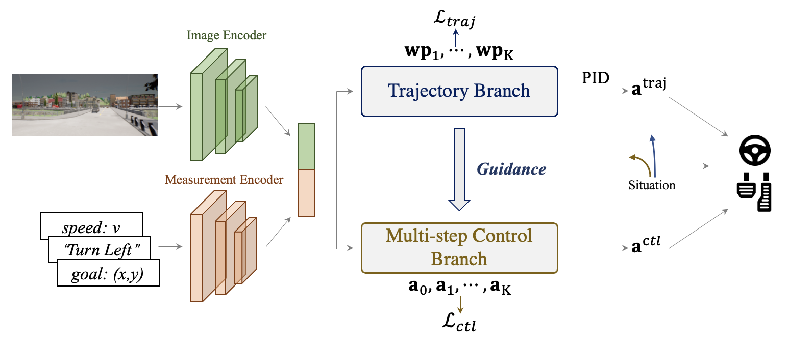

> [!IMPORTANT]
> 🌟 Stay up to date at [opendrivelab.com](https://opendrivelab.com/#news)!

# SafeBenchHK 集成说明

本目录保留 TCP 端到端驾驶模型，以及 SafeBenchHK 调用 TCP 时依赖的 CARLA Leaderboard / ScenarioRunner 组件。当前项目中主要包含：

- `TCP/`: TCP 模型、数据封装、增强、配置和训练代码。
- `leaderboard/`: CARLA Leaderboard evaluator、路线/场景数据、agent wrapper 和 TCP agent 入口。
- `scenario_runner/`: Leaderboard 栈使用的 ScenarioRunner 运行时和场景工具。
- `roach/`: TCP 相关 agent 依赖的 Roach 鸟瞰图策略、指标和工具。
- `tools/`: TCP 数据生成、过滤和统计辅助脚本。

模型权重、运行日志、鸟瞰图地图缓存、视频等大型运行产物应保留在本地，已由根目录 `.gitignore` 覆盖。下方保留上游 TCP README，用于查询模型环境、数据生成、训练和评测细节。

# TCP - Trajectory-guided Control Prediction for End-to-end Autonomous Driving: A Simple yet Strong Baseline



> Trajectory-guided Control Prediction for End-to-end Autonomous Driving: A Simple yet Strong Baseline  
> [Penghao Wu*](https://scholar.google.com/citations?user=9mssd5EAAAAJ&hl=en), [Xiaosong Jia*](https://jiaxiaosong1002.github.io/), [Li Chen*](https://scholar.google.com/citations?user=ulZxvY0AAAAJ&hl=en), [Junchi Yan](https://thinklab.sjtu.edu.cn/), [Hongyang Li](https://lihongyang.info/), [Yu Qiao](http://mmlab.siat.ac.cn/yuqiao/)    
>  - [arXiv Paper](https://arxiv.org/abs/2206.08129), NeurIPS 2022
>  - [Blog in Chinese](https://zhuanlan.zhihu.com/p/532665469)

	
[](https://paperswithcode.com/sota/autonomous-driving-on-carla-leaderboard?p=trajectory-guided-control-prediction-for-end)

This repository contains the code for the paper [Trajectory-guided Control Prediction for End-to-end Autonomous Driving: A Simple yet Strong Baseline](https://arxiv.org/abs/2206.08129).


TCP is a simple unified framework to combine trajectory and control prediction for end-to-end autonomous driving.  By time of release in June 17 2022, our method achieves new state-of-the-art on [CARLA AD Leaderboard](https://leaderboard.carla.org/leaderboard/), in which we rank the **first** in terms of the Driving Score and Infraction Penalty using only a single camera as input. 


## Setup
Download and setup CARLA 0.9.10.1
```
mkdir carla
cd carla
wget https://carla-releases.s3.eu-west-3.amazonaws.com/Linux/CARLA_0.9.10.1.tar.gz
wget https://carla-releases.s3.eu-west-3.amazonaws.com/Linux/AdditionalMaps_0.9.10.1.tar.gz
tar -xf CARLA_0.9.10.1.tar.gz
tar -xf AdditionalMaps_0.9.10.1.tar.gz
rm CARLA_0.9.10.1.tar.gz
rm AdditionalMaps_0.9.10.1.tar.gz
cd ..
```

Clone this repo and build the environment

```
git clone https://github.com/OpenPerceptionX/TCP.git
cd TCP
conda env create -f environment.yml --name TCP
conda activate TCP
```

```
export PYTHONPATH=$PYTHONPATH:PATH_TO_TCP
```

## Dataset

Download our dataset through [Huggingface](https://huggingface.co/datasets/craigwu/tcp_carla_data) (combine the part with command `cat tcp_carla_data_part_* > tcp_carla_data.zip`) or [GoogleDrive](https://drive.google.com/file/d/1HZxlSZ_wUVWkNTWMXXcSQxtYdT7GogSm/view?usp=sharing) or [BaiduYun](https://pan.baidu.com/s/11xBZwAWQ3WxQXecuuPoexQ) (提取码 8174). The total size of our dataset is around 115G, make sure you have enough space.

## Training
First, set the dataset path in ``TCP/config.py``.
Training:
```
python TCP/train.py --gpus NUM_OF_GPUS
```


